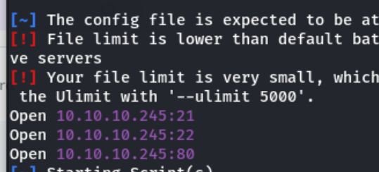
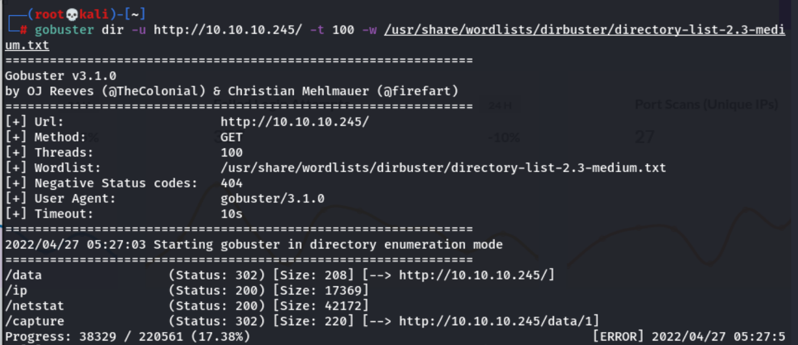
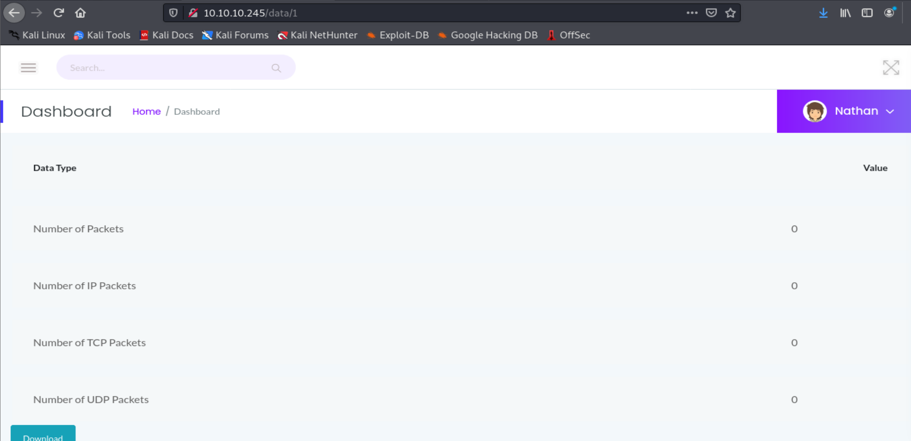
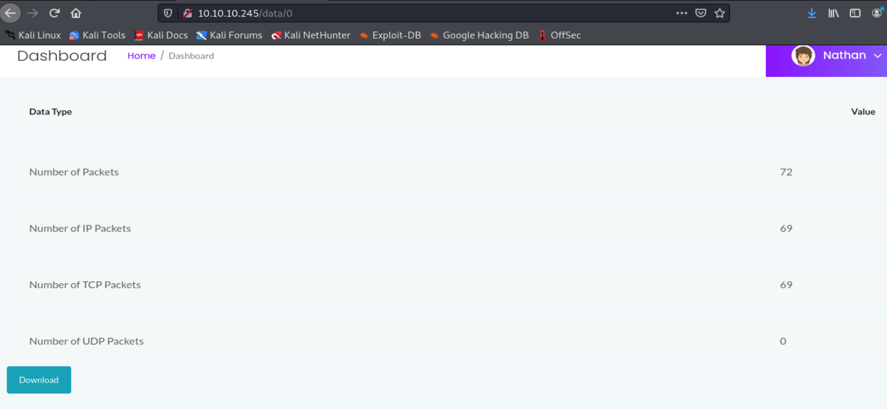
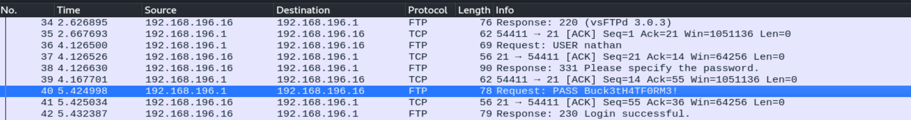
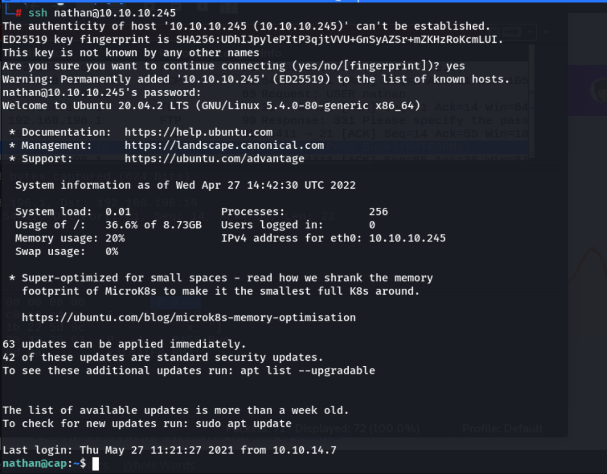
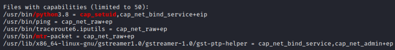
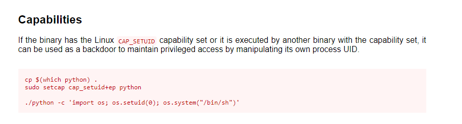
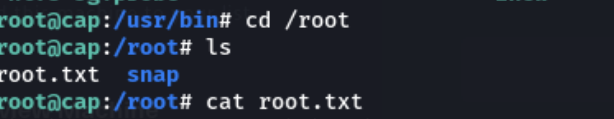

---

### Knowledge Gained 🙉
- GTFObins
- wireshark
- capabilities


---

## Enumeration

First we did a `rustscan` + `nmap` scan, which found 3 ports, **SSH**, **FTP**, and **HTTP**.

```
rustscan -a 10.10.10.245
```



Next I run `gobuster` to find sub directories for the website. Nothing much is interesting.

```
gobuster dir -u http://10.10.10.245 -w /usr/share/wordlists/dirbuster/directory-list-2.3-medium.txt -t 100

```



---

## Foothold

When I browse around the website, I noticed that the only one interesting page is the `data` page. It seems to include a **pcap** file that it capture.



I then noticed that the url shows a **ID** number at the end, so I played with it a bit and found out that if I change the ID num to **0**, a very interesting capture shows up.



I then downloaded the file and open in up with `wireshark` and found some creds inside!



I then use the creds to connect to `SSH` and it worked!



---

## Privilege Escalation

After I took the user flag, I then move on to priv esc. I used `Linpeas` to enumerate the machine, and found one interesting point. It appears the `/usr/bin/python3.8` binary has the `cap_setuid` capability enabled.



So I went to [GTFObins](https://gtfobins.github.io/gtfobins/python/) to find some more info and upon consulting GTFOBins, it appears this can be exploited, as it practically works in the same way as SETUID:



Running the command mentioned above and we gain root-level privileges.



Thats all for this box, thanks for reading!
