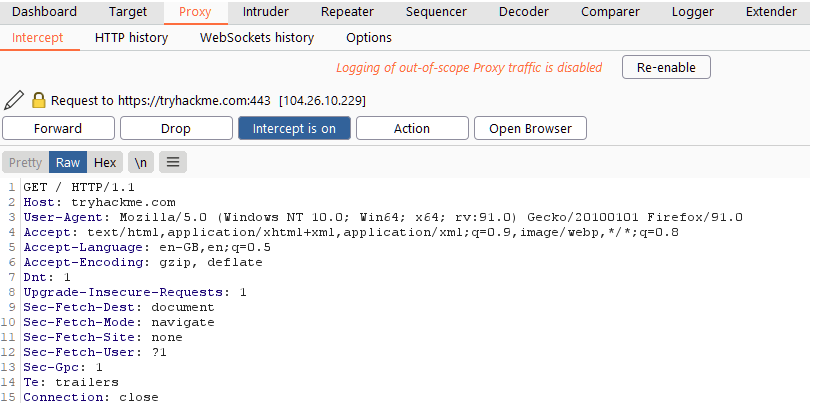
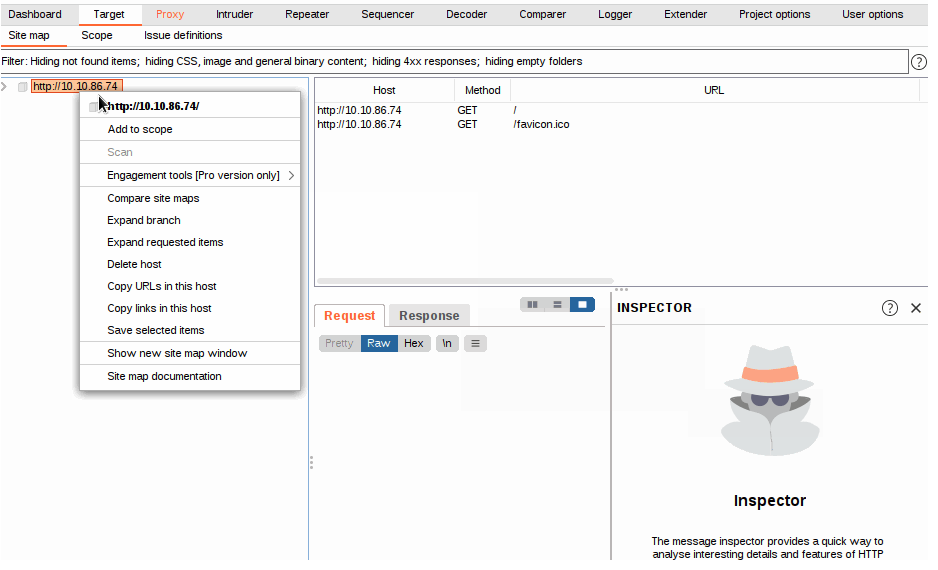
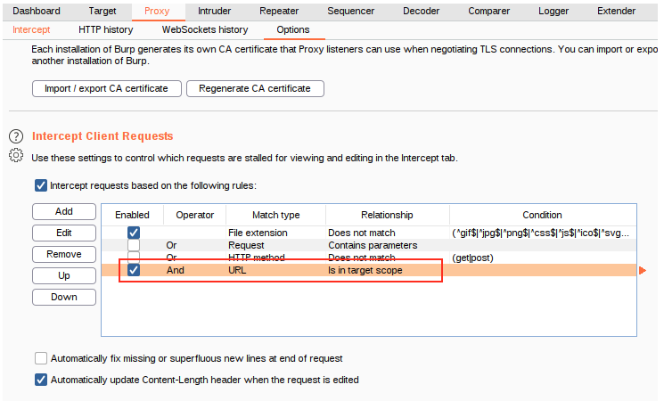
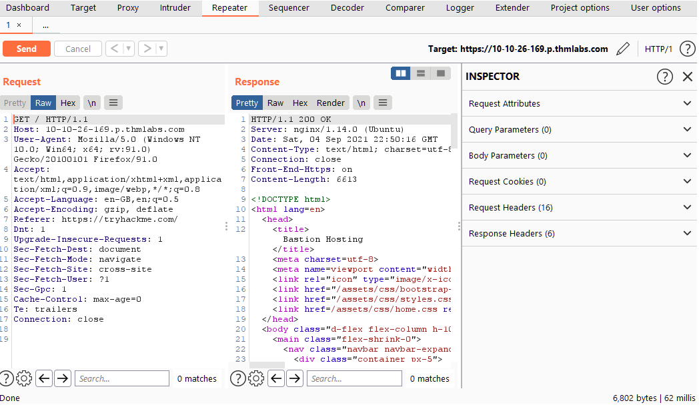
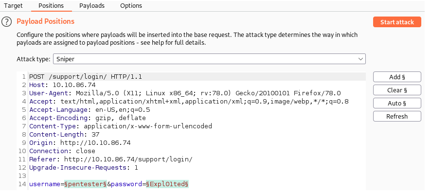
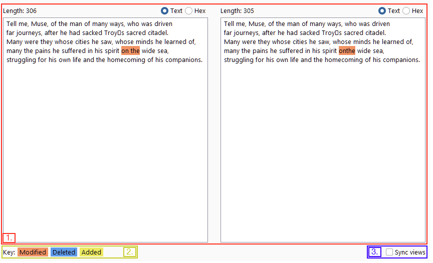

## What is Burp Suite?

Burpsuite is a framework that aids in **web application penetration testing**. Burp Suite is also very commonly used when assessing mobile applications, as the same features which make it so attractive for web app testing translate almost perfectly into testing the APIs powering most mobile apps.

Whilst Burp Community has a relatively limited feature-set compared to the Professional edition, it still has many superb tools available. These include:

- **Proxy** : The most well-known aspect of Burp Suite, the Burp Proxy allows us to intercept and modify requests/responses when interacting with web applications.  
#
- **Repeater** : The second most well-known Burp feature -- Repeater -- allows us to capture, modify, then resend the same request numerous times. This feature can be absolutely invaluable, especially when we need to craft a payload through trial and error (e.g. in an SQLi -- Structured Query Language Injection) or when testing the functionality of an endpoint for flaws.
#
- **Intruder** : Intruder allows us to spray an endpoint with requests. This is often used for bruteforce attacks or to fuzz endpoints.
#
- **Decoder** : Decoder provides a valuable service when transforming data -- either in terms of decoding captured information, or encoding a payload prior to sending it to the target. 
#
- **Comparer** : As the name suggests, Comparer allows us to compare two pieces of data at either word or byte level.
#
- **Sequencer** : We usually use Sequencer when assessing the randomness of tokens such as session cookie values or other supposedly random generated data. If the algorithm is not generating secure random values, then this could open up some devastating avenues for attack.
#

---

## Burp Proxy

The Burp Proxy is the most fundamental (and most important!) of the tools available in Burp Suite. It allows us to **capture requests** and responses between ourselves and our target. These can then be manipulated or sent to other tools for further processing before being allowed to continue to their destination.

For example, if we make a request to *https://tryhackme.com* through the Burp Proxy, our request will be captured and won't be allowed to continue to the TryHackMe servers until we explicitly allow it through. We can choose to do the same with the response from the server, although this isn't active by default. This ability to intercept requests ultimately means that we can take complete control over our web traffic -- an invaluable ability when it comes to testing web applications.

It can get extremely tedious having Burp capturing all of our traffic. When it logs everything (including traffic to sites we aren't targeting), it muddies up logs we may later wish to send to clients. In short, allowing Burp to capture everything can quickly become a massive pain.

What's the solution? ***Scoping***.

Setting a scope for the project allows us to *define what gets proxied and logged*. We can restrict Burp Suite to only target the web application(s) that we want to test. The easiest way to do this is by switching over to the `Target` tab, right-clicking our target from our list on the left, then choosing `Add To Scope`. Burp will then ask us whether we want to stop logging anything which isn't in scope -- most of the time we want to choose "yes".

We just chose to disable logging for out of scope traffic, but the proxy will still be intercepting everything. To turn this off, we need to go into the Proxy Options sub-tab and select "And URLIs in target scope" from the Intercept Client Requests section:

With this option selected, the proxy will completely ignore anything that isn't in the scope, vastly cleaning up the traffic coming through Burp.

---

## Burp Repeater

Repeater allows us to **_craft or relay intercepted requests_** to a target at will. It means we can take a request captured in the Proxy, edit it, and send the same request repeatedly as many times as we wish. 

This ability to edit and resend the same request multiple times makes Repeater ideal for any kind of manual poking around at an endpoint, providing us with a nice Graphical User Interface (GUI) for writing the request payload and numerous views of the response so that we can see the results of our handiwork in action.

If we want to change anything about the request, we can simply type in the Request window and press "Send" again; this will update the Response on the right.

---

## Burp Intruder

Intruder is Burp Suite's in-built fuzzing tool. It allows us to take a request and use it as a template to **_send many more requests_** with slightly altered values automatically. 

For example, by capturing a request containing a login attempt, we could then configure Intruder to swap out the username and password fields for values from a wordlist, effectively allowing us to bruteforce the login form. Similarly, we could pass in a fuzzing[1] wordlist and use Intruder to fuzz for subdirectories, endpoints, or virtual hosts. This functionality is very similar to that provided by command-line tools such as Wfuzz or Ffuf.

There are four other Intruder sub-tabs:

- **Positions** allows us to select an Attack Type, as well as configure where in the request template we wish to insert our payloads.
#
- **Payloads** allows us to select values to insert into each of the positions we defined in the previous sub-tab. For example, we may choose to load items in from a wordlist to serve as payloads. How these get inserted into the template depends on the attack type we chose in the Positions tab. There are many payload types to choose from (anything from a simple wordlist to regexes based on responses from the server). The Payloads sub-tab also allows us to alter Intruder's behaviour with regards to payloads; for example, we can define pre-processing rules to apply to each payload (e.g. add a prefix or suffix, match and replace, or skip if the payload matches a defined regex).
#
- **Resource Pool** is not particularly useful to us in Burp Community. It allows us to divide our resources between tasks. Burp Pro would allow us to run various types of automated tasks in the background, which is where we may wish to manually allocate our available memory and processing power between these automated tasks and Intruder. Without access to these automated tasks, there is little point in using this, so we won't devote much time to it.
#
- As with most of the other Burp tools, Intruder allows us to configure attack behaviour in the **Options** sub-tab. The settings here apply primarily to how Burp handles results and how Burp handles the attack itself. For example, we can choose to flag requests that contain specified pieces of text or define how Burp responds to redirect (3xx) responses.

When we are looking to perform an attack with Intruder, the first thing we need to do is look at positions. Positions tell Intruder where to insert payloads.

Notice that Burp will attempt to determine the most likely places we may wish to insert a payload automatically -- these are highlighted in green and surrounded by silcrows (§).

There are 4 attack types: 

- **Sniper** - One set of payload. Intruder will take each position and substitute each payload into it in turn. Good for single-position attacks. _E.g. password_
  

- **Battering Ram** - One set of payload. Puts the same payload in **_every_** position rather than in each position in turn.
  

- **Pitchfork** - One set of payload per position. It's like having numerous Sniper running simultaneously. This attack type is exceptionally useful when forming things like **_credential stuffing attacks_**.
  
    #
    This type of attack can take a little time to get your head around, so let's use our bruteforce example from before, but this time we need two wordlists:

    - Our first wordlist will be usernames. It contains three entries: joel, harriet, alex.

    - Let's say that Joel, Harriet, and Alex have had their passwords leaked: we know that Joel's password is J03l, Harriet's password is Emma1815, and Alex's password is Sk1ll.

- **Cluster Bomb** - Multiple payload sets: one per position. Cluster bomb iterates through each payload set individually, making sure that _every possible combination_ of payloads is tested.

    #
    Let's use the same wordlists as before:

    - Usernames: joel, harriet, alex.

    - Passwords: J03l, Emma1815, Sk1ll.
  
But, this time, let's assume that we don't know which password belongs to which user. We have three users and three passwords, but we don't know how to match them up. In this case, we would use a cluster bomb attack; this will try every combination of values. The request table for our username and password positions looks something like this:

---

## Burp Decoder

The Burp Suite Decoder module allows us to manipulate data. As the name suggests, we can **_decode_** information that we capture during an attack, but we can also **_encode_** data of our own, ready to be sent to the target. Decoder also allows us to create **_hashsums_** of data, as well as providing a Smart Decode feature which attempts to decode provided data recursively until it is back to being plaintext (like the "Magic" function of _Cyberchef_).

---

## Burp Comparer

As the name suggests, Comparer allows us to **_compare_** two pieces of data, either by ASCII words or by bytes.

---

## Burp Sequencer

Sequencer is one of those tools that rarely ever gets used in CTFs and other lab environments but is an essential part of a real-world web app penetration test. In short, Sequencer allows us to **_measure the entropy_** (or randomness, in other words) of "tokens" -- strings that are used to identify something and should, in theory, be generated in a cryptographically secure manner. 

For example, we may wish to analyse the randomness of a session cookie or a _Cross-Site Request Forgery (CSRF)_ token protecting a form submission. If it turns out that these tokens are not generated securely, then we can (in theory) predict the values of upcoming tokens. Just imagine the implications of this if the token in question is used for password resets...

There are two main methods we can use to perform token analysis with Sequencer:

- **Live capture** is the more common of the two methods -- this is the default sub-tab for Sequencer. Live capture allows us to pass a request to Sequencer, which we know will create a token for us to analyse. For example, we may wish to pass a POST request to a login endpoint into Sequencer, as we know that the server will respond by giving us a cookie. With the request passed in, we can tell Sequencer to start a live capture: it will then make the same request thousands of times automatically, storing the generated token samples for analysis. Once we have accumulated enough samples, we stop Sequencer and allow it to analyse the captured tokens.
#
- **Manual load** allows us to load a list of pre-generated token samples straight into Sequencer for analysis. Using Manual Load means we don't have to make thousands of requests to our target (which is both loud and resource intensive), but it does mean that we need to obtain a large list of pre-generated tokens!

---

## Burp Extender

The Burp App Store (or BApp Store for short) gives us a way to easily list official **_extensions_** and integrate them seamlessly with Burp Suite. Extensions can be written in a variety of languages -- most commonly Java (which integrates into the framework automatically) or Python (which requires the Jython interpreter).
#
#
---

