---

### Knowledge Gained 🙉
- psexec
- Windows File System

---

## Enumeration

First off, we scan the machine and noticed a lot of ports opened. `WinRM `(Windows Remote Management) is a Microsoft protocol that allows remote management of Windows machines over HTTP(S) using SOAP. On the backend it's utilising WMI, so you can think of it as an HTTP based API for WMI.

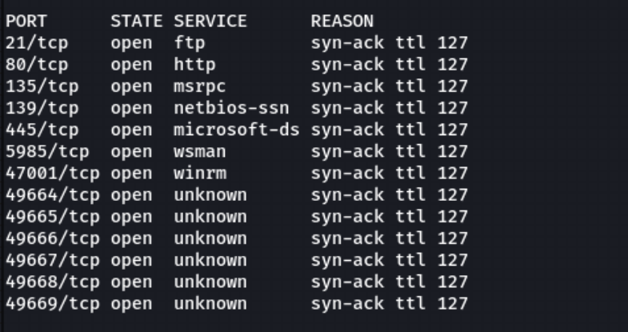

I first start off with the ftp server and check if the server allows **anonymous** acces. And it does!

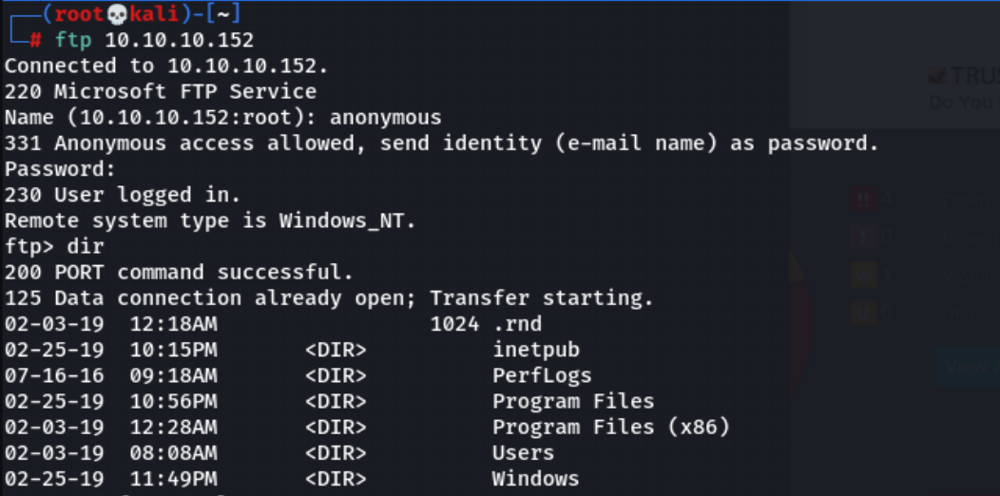

Suprisingly, the user flag is get right there! I downloaded it using the get command.

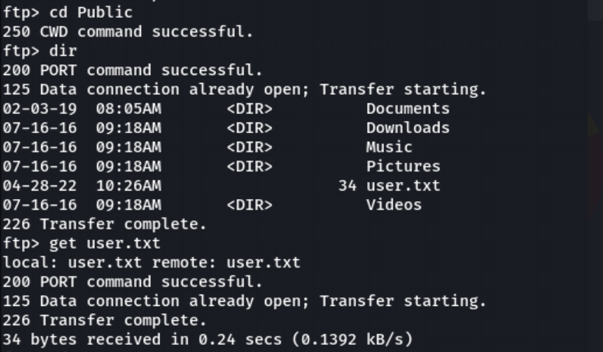

After that, I move on to the website, the website is a monitor program that needs login.

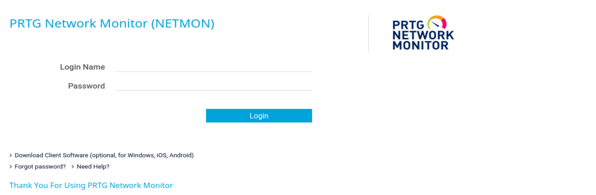

I then googled for default creds for the program, and found one default creds. But unfortunately, the default creds did not work.

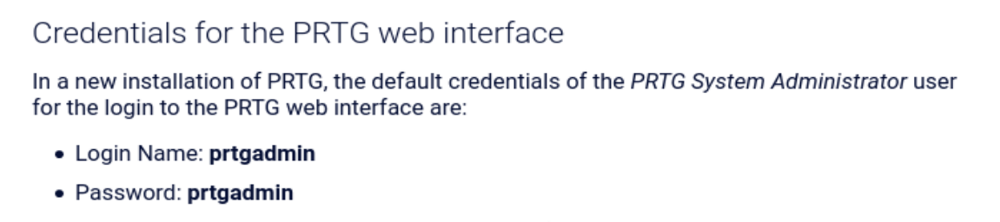

Then, I thought that since I have access to the ftp server, maybe I can view the **configuration files/ database files** for the program. So, I searched up where does the config/database files are stored. So it is stored at `\ProgramData\Paessler\PRTG Network Monitor`

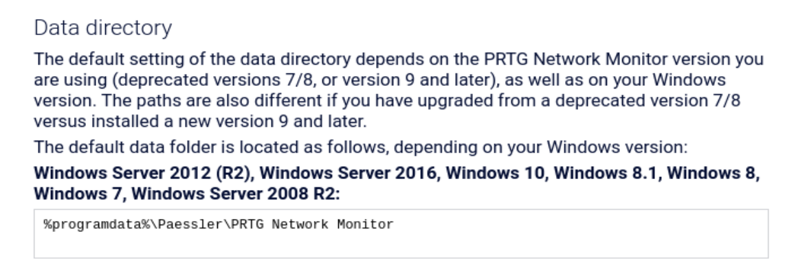

I then use the `ftp` server to access the location and found **3** config files inside. I downloaded them all to my local machine to take a look at whats inside.

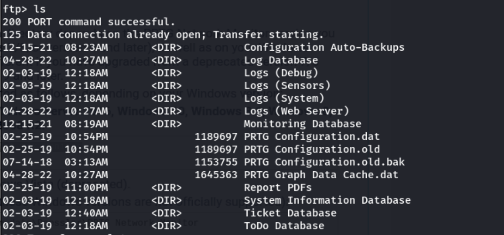

In the `PRTG Configuration.old.bak` file, theres a set of credentials in it! I grabbed the creds and use it on the login page. Suprisingly, it did not work.

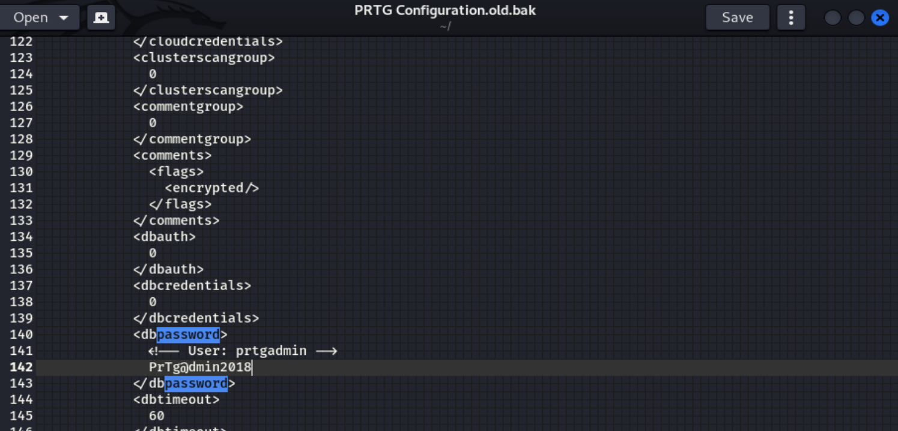

The is where a little bit of creativity is needed. As this file is a old backup file from **2018**, most likely the password is out of date. So the user might changed it to another date such as `PrTg@dmin2019`
#
And it worked! The correct creds is `prtgadmin:PrTg@dmin2019`

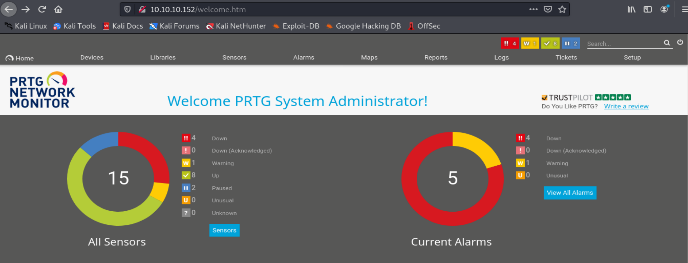

---

## Foothold

During enumeration phase, I noticed that there is one exploit for the PRTG program, that is the [Authenticated RCE exploit](https://www.exploit-db.com/exploits/46527). I looked it up using `searchploit` and copied it down to my machine.

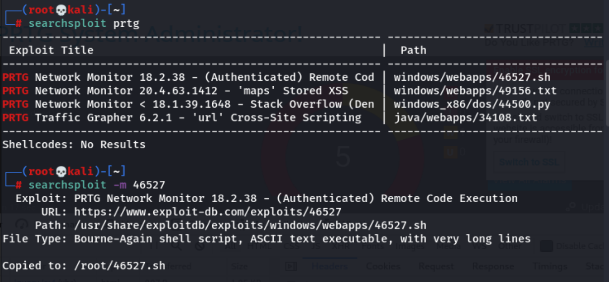

I ran the script and it worked!

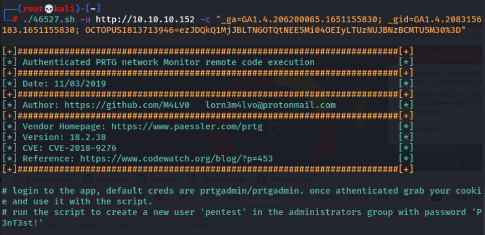

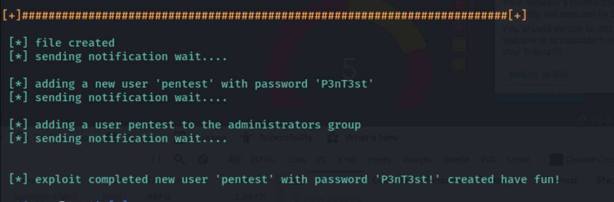

---

## Privilege Escalation

I then use [psexec.py](https://www.infosecmatter.com/rce-on-windows-from-linux-part-1-impacket/) with the creds we have and we are root!

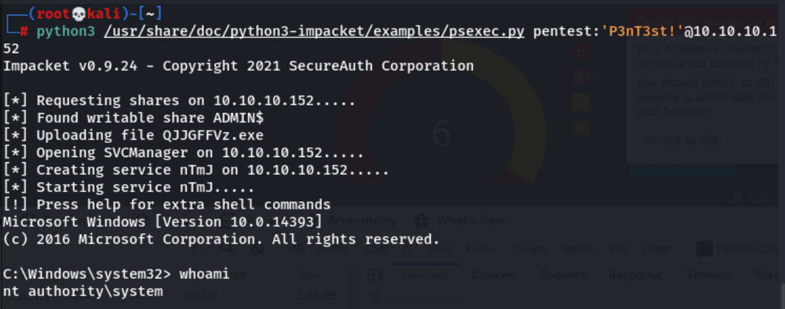

Thats all for this machine, thanks for reading!