LazyAdmin is a easy rated box on THM. It is a good box to brush up my skills and I learned a lot from it.

---

## Enumeration

First, I run a `Nmap` scan and 2 open ports are found: port **80** and port **22**

    nmap --top-ports 50 10.10.127.148

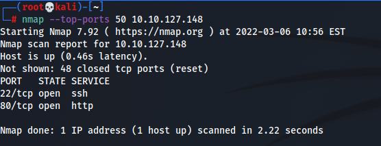

Then, I run a gobuster scan to search for other subdirectories, and I found a `/content` subdirectory page.

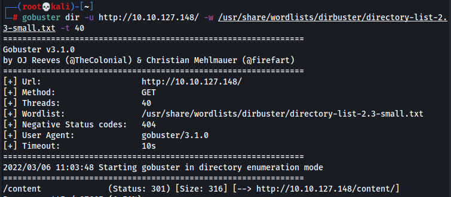

---

## Exploitation

I visit the page and found something new: `SweetRice CMS`.

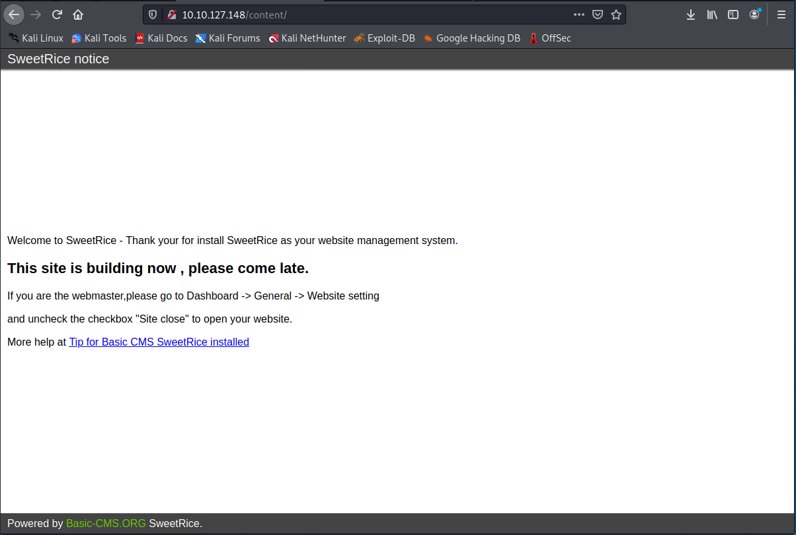

I then use `searchsploit` to find vulnerabilities related to this program, and I found quite a lot of them. The interesting ones are the Arbitrary **File Upload** and the **PHP Code Execution**.

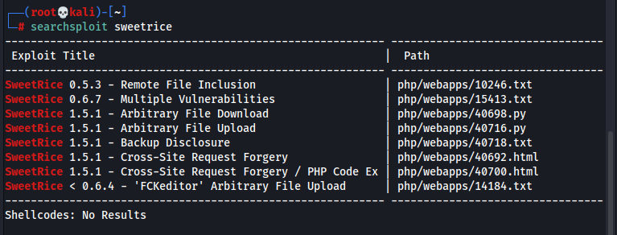

Looking at the payload, it requires credentials in order to upload the file, so I had to find a way to find creds.

After poking around, I cant find anything, so I run another `gobuster` scan on the `/content`  directory. It turns out, the real thing is inside here.

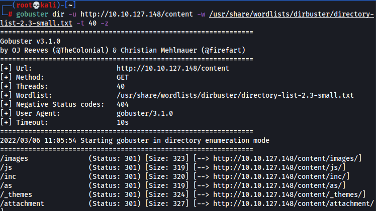

I went to check the /inc sub directory, and it had lots of files in it, but one file is super interesting: `mysql_backup/`

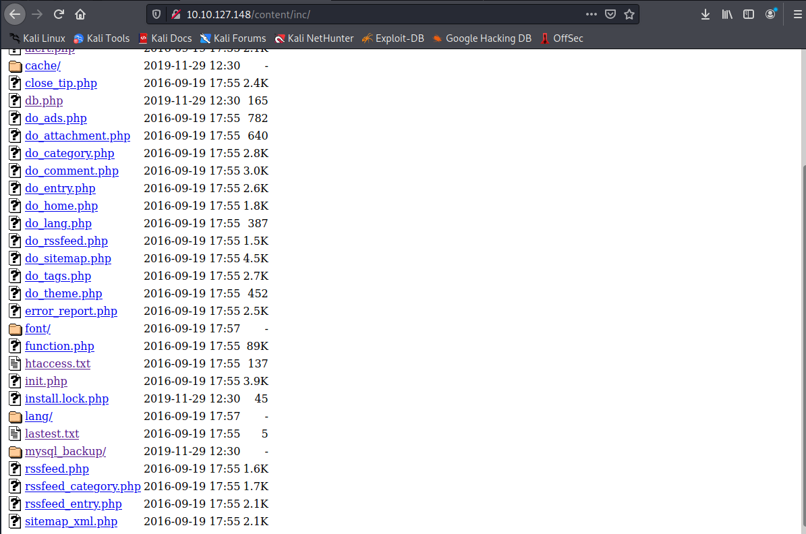

BOOOM! There are creds inside the backup file.But the password seems to be encrypted.

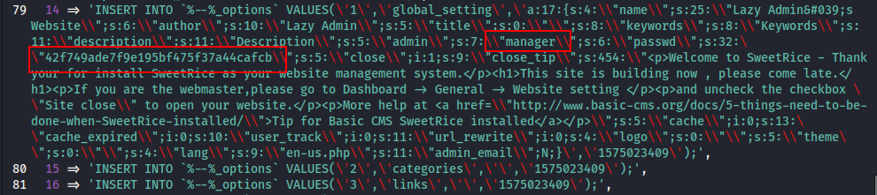

So I went to decrypt the password and got the plaintext: `Password123`

I quickly went back to the exploit and key in all the creds along with the reverse shell I made from _pentestmonkey_. But I cant seem to get it to work...

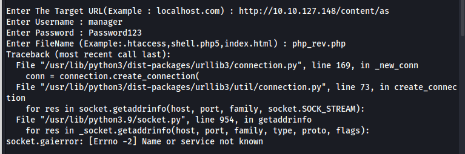

I was quite stuck at this moment.. then I looked back my scans and see if theres anything more left, and I found out that the `/as` page was the login panel for the website!

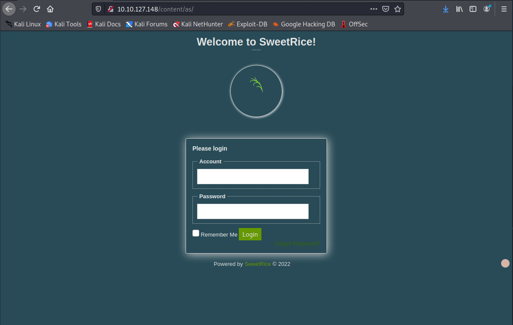

I then key in my creds and logged in to the website. `manager:Password123`

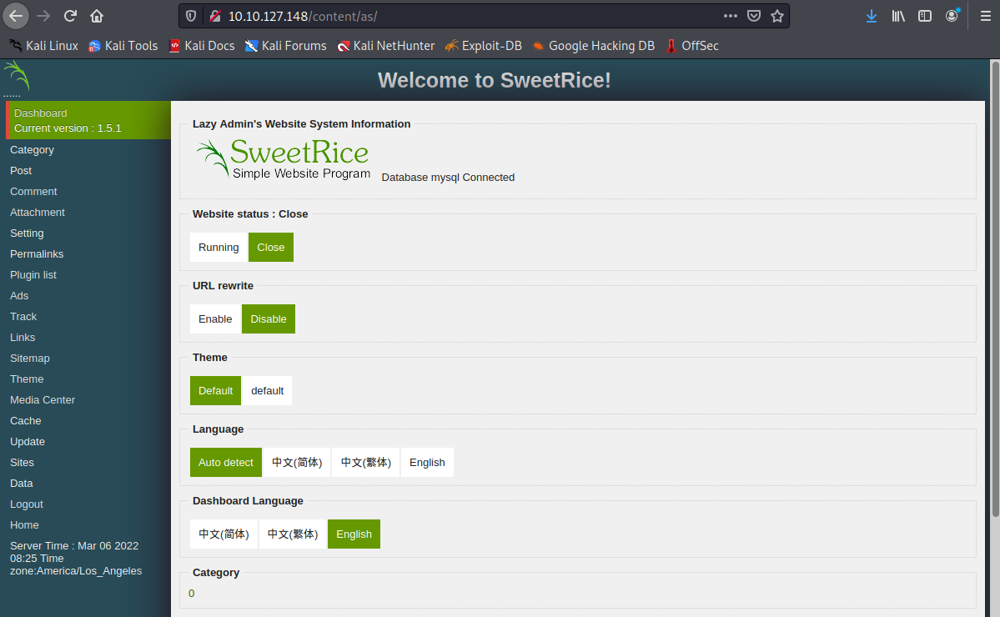

I then poked around and found out that the Ads section can allow me to inject code. I then copied the reverse shell PHP code from _pentestmonkey_ and edit it with my own IP address and port.

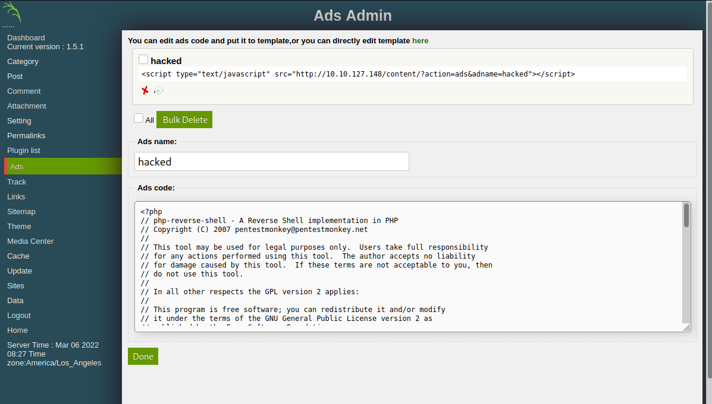

Then I went back to the `/inc` page and access my shell there..

And then BOOM, I got a shell back!

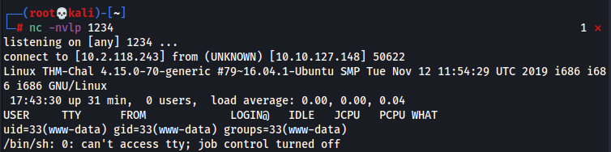

I quickly get the _**user.txt**_ file and submit it.

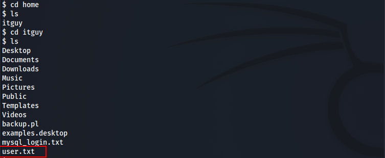

---

## Privilege Escalation

The fastest way to priv esc is to use `sudo -l`, and indeed it listed something we can use. We can run the `backup.pl` script as root, so all we have to do is replace the content of the script and run it as sudo.

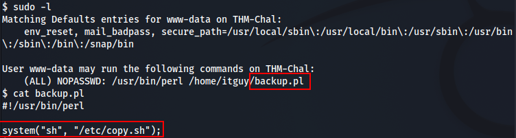

Replace the file content with a reverse shell and run the script using sudo.

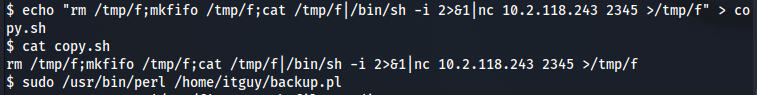

And BOOOM, we are root!

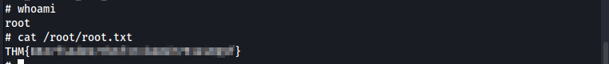

---

That's it for this box, thanks for reading!