---

### Knowledge Gained 🙉
- LFI and Directory Traversal
- gdbserver
- screen
- rustscan
- wpscan

---


## Enumeration

In this machine, I learned a new way to scan for open ports, that is using [rustscan](https://github.com/RustScan/RustScan). It took less than few seconds for it to find the ports open and it also runs nmap automatically. The scan shows that we have 3 open ports running, port **22**, **80** and **1337**.

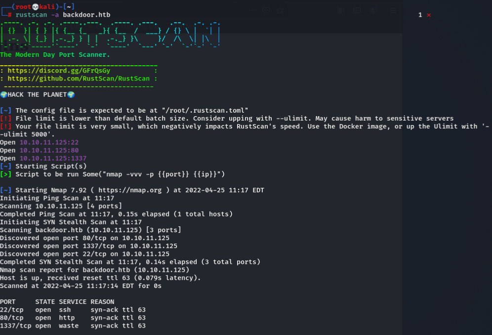

First I took a look at the **port 80** website, it shows that it is a website built using _**Wordpress**_, therefore we can run `wpscan` to enumerate more infos about the website. There are lots of WP plugins that are vulnerable, so we can try if we can find any vulnerable ones.

```
wpscan --url http://backdoor.htb/ 
```

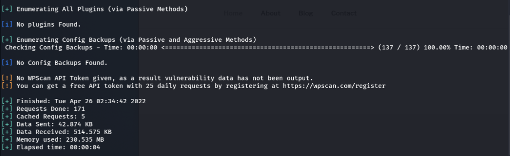

Looks like we have found nothing interesting from the scan, there are no plugins found(via passive mode), but theres is another way of finding plugins that is using **aggresive mode**. But before we can use that mode, we need to singup to wpscan in order to get the **api-token**. After using the api-token, we can see more results from the wpscan, we have found one plugins that is vulnerable, and one user named _**admin**_.

```
wpscan --url http://backdoor.htb/ --api-token G4Zkc6WaaftaniPUQYnDEdV6JxwdK7eo0oj2YkI9Jrw -e p,u --plugins-detection aggressive
```

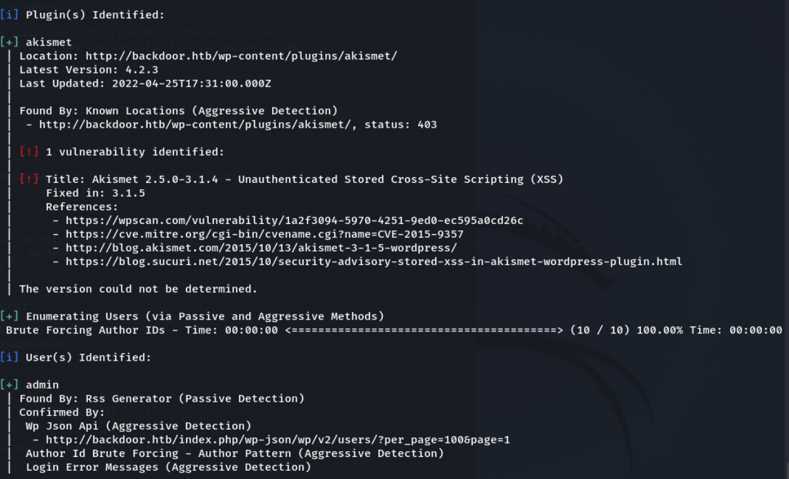

Following the plugins, we have found another plugins named `ebook` in the plugins page. Looking through the readme.txt we know that the version is **1.1** and it is [vulnerable](https://www.exploit-db.com/exploits/39575).

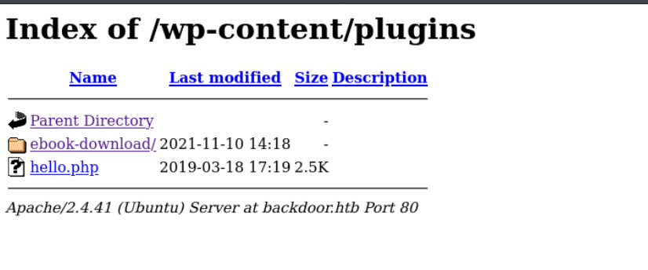


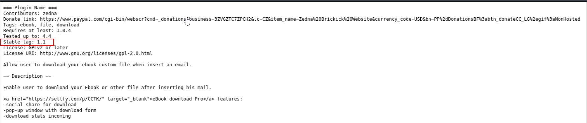

Looking at the exploit, it seems to be a _**Directory Traversal**_ vulnerability, which can allow us to read files from the url itself.

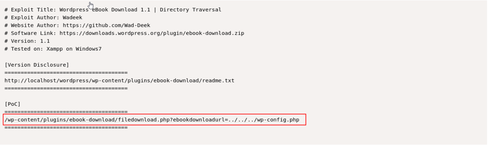

After looking at the contents of the `wp-config.php` file, I found some creds!

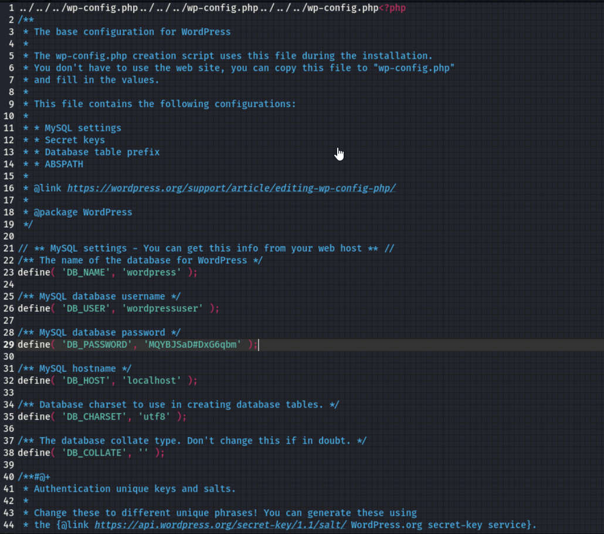

However, I tried logging in using the creds but nothing worked.

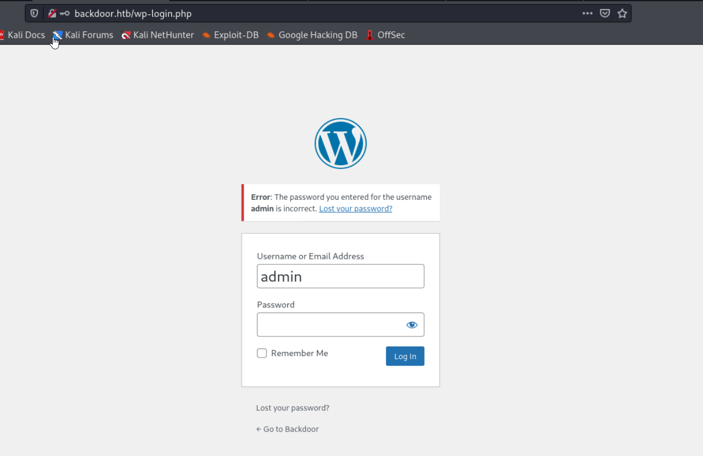

I then tried listing other files that are interesting like the `/etc/passwd` file, but nothing interesting.

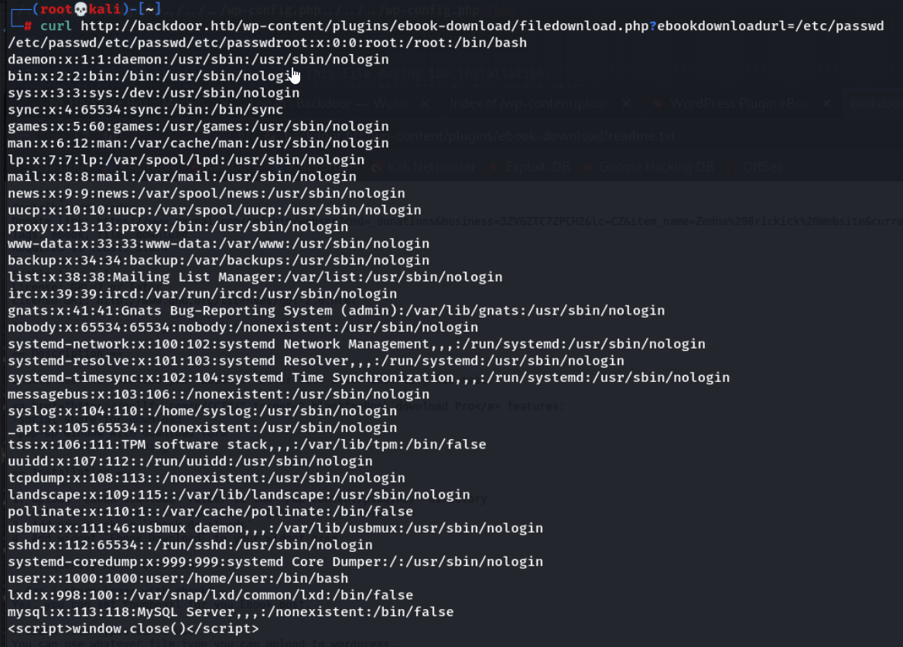

---


## Foothold

Since there is a port 1337 listening, I decided to try enumerating processes. So, `/proc/[PID]/cmdline` in Linux is basically representing a currently running process. 
More on the article [here.](https://www.netspi.com/blog/technical/web-application-penetration-testing/directory-traversal-file-inclusion-proc-file-system/)  

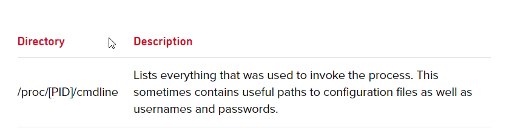
#
I used [wfuzz](https://wfuzz.readthedocs.io/en/latest/) to bruteforce through the PID and got back **4** processes. `Wfuzz` is based on a simple concept: it replaces any reference to the FUZZ keyword by the value of a given payload.

```
wfuzz -u http://backdoor.htb/wp-content/plugins/ebook-download/filedownload.php?ebookdownloadurl=/proc/FUZZ/cmdline -z range,1-1000 --hw 1
```

I then listed out all the PIDs and see what are they running.

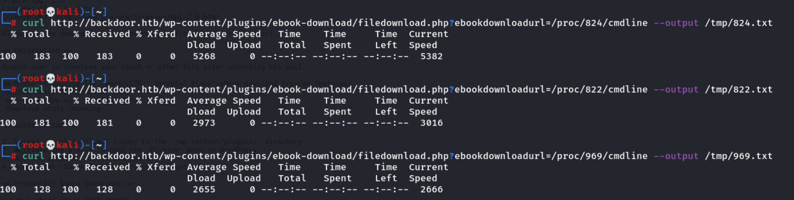

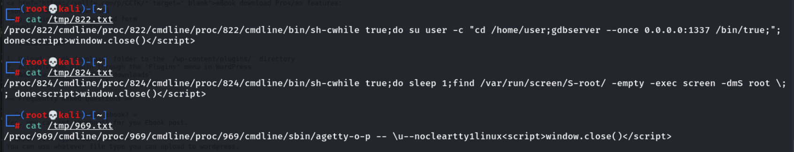

On** PID 822**, there is a `gdbserver` running on port 1337, that might be the one we are looking for. So I searched up the exploit and found one [here](https://www.rapid7.com/db/modules/exploit/multi/gdb/gdb_server_exec/) using metasploit.

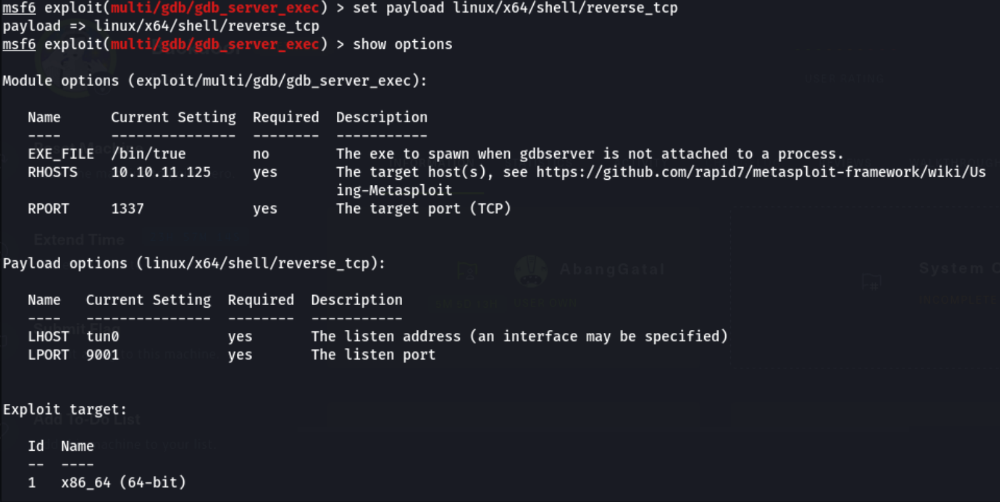

I run the exploit and got a shell back. I then access the user flag.

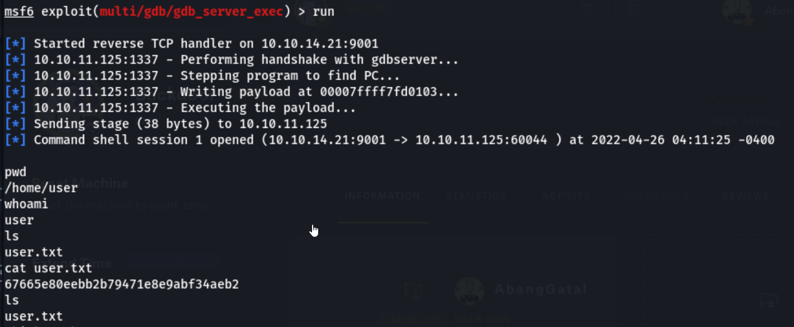

---

## Priv Esc

I used `LinPeas` to do more enumeration on the machine, then I found something interesting, a `screen` process is running as root.

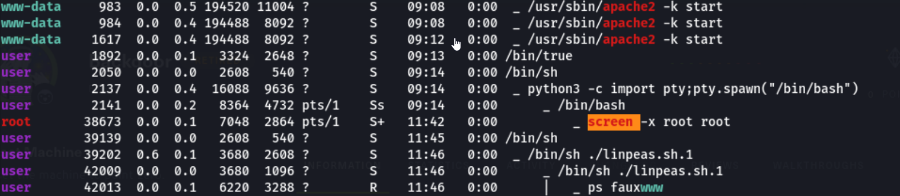


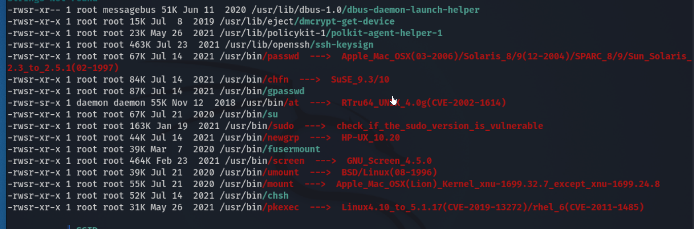


After doing some research, I found out that I can use the `-x` command to attach to a session. Since root has already opened a session, I just need to attach to it using the command:

```
screen -x root/root
```

First, we have to set the terminal emulator to Linux by using `export TERM=xterm`. You can check your TERM setting by running `echo $TERM`. Now just run the screen command as shown.

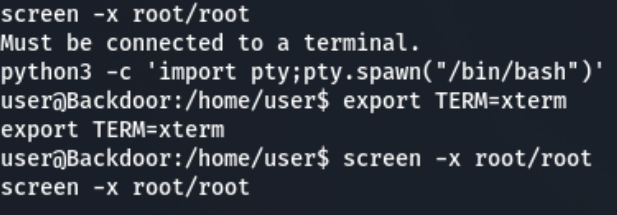


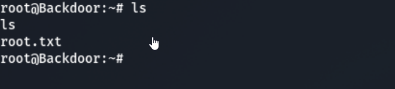

And thats all for this machine, thanks for reading!


